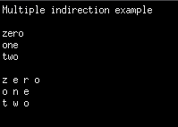

# Multiple indirection with Strings

Let's look at another example of multiple indirection, this time with an array of Strings.

```c
#include <stdio.h>

#define LENGTH 3

char *words[LENGTH];

int main(int argc, char **argv) {
    char *pc;
    char **ppc;

    printf("Multiple indirection example\n\n");

    words[0] = "zero";
    words[1] = "one";
    words[2] = "two";
    for (int i=0; i < LENGTH; i++) {
        printf("%s\n", words[i]);
    }
    printf("\n");

    ppc = words;
    for (int i=0; i < LENGTH; i++) {
        ppc = words + i;
        pc = *ppc;

        while(*pc != 0) {
            printf("%c-", *pc);
            pc += 1;
        }

        printf("\n");
    }

    return 0;
}
```

On this program we use three variables: __pc__ a character pointer, __ppc__ a pointer to a character pointer, __words__ an array to hold a sequence of Strings. Remember that in _C_ a String is a sequence of characters terminated by `null` so we can declare a String as a pointer to a `char`, that is, a pointer to the address of the start of the array of characters in a String.

When initializing our Strings variables, or a String element in an array, *C* automatically appends a `null` terminator to that String. More down into the code, we've assigned to __ppc__ variable the pointer to a pointer to the array, that is, to the address of the start of the array.

The `for` loop iterates through the array of Strings and then inside the `while` loop iterates through the characters in each String printing them out one by one. The outer `for` loop moves the __ppc__ pointer through the array by adding `1` to the array address. Like that: `ppc = words + i`.

And what *"Moving the pointer"* should means to you is that the address, also the number, stored by the pointer variable is updated to a different address. And we can think of this as moving the pointer because the value that pointer variable stores determines the address that can be accessed using the pointer.

At each turn of the `for` loop __ppc__ is moved to point the start of the next String in the array, __pc__, the pointer to _`char`, is then moved to point to the first character of the String pointed to by __ppc__. We do this by dereferencing the __*ppc__ pointer to access the pointer __pc__ to which __ppc__ points.

The `while` loop executes and keeps running as long as the `char` pointed to by __pc__  is not known, we get the `char` itself by dereferencing the pointer by placing an asterisk before is as __*pc__.

We print the current `char` plus a space, then the __pc__ `char` pointer is moved to point to the next `char` in the current String, that is: `pc += 1`.



So as we can see that is iterated through the array of 3 string `"zero"`, `"one"`, `"two"` and printed them out one character at a time separated by spaces which is what we've expected based on the loops in the code.

If you're new to pointers this code may take some thinking about it to understand exactly how it works and you might find it useful to trace through your code with a debugger.

So in order to understand pointers, because they really are quite difficult to understand when you are learning how to use them, I really adivise you to take your time to write some code and use your debugger to see how the pointers work, what they're pointing out and how their values change.
